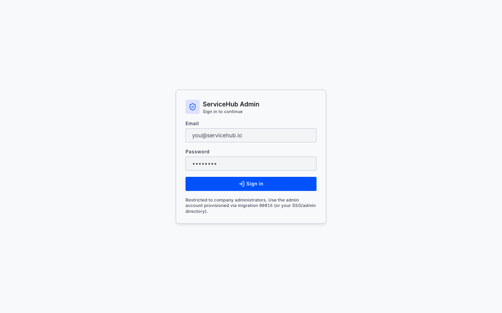
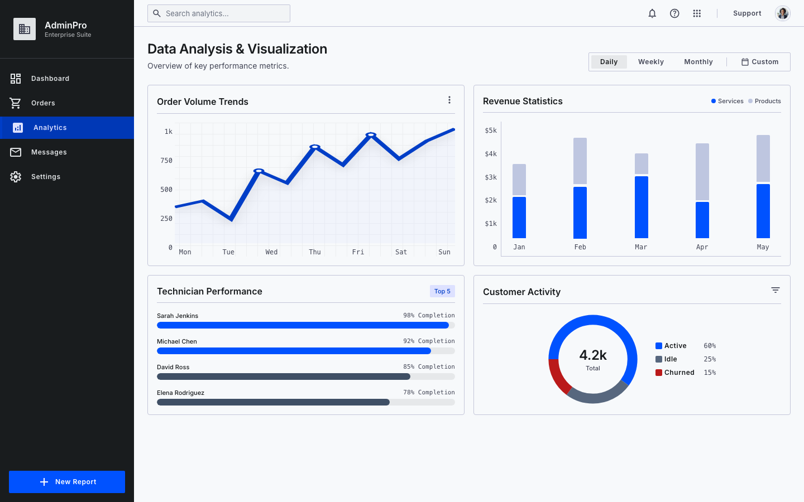
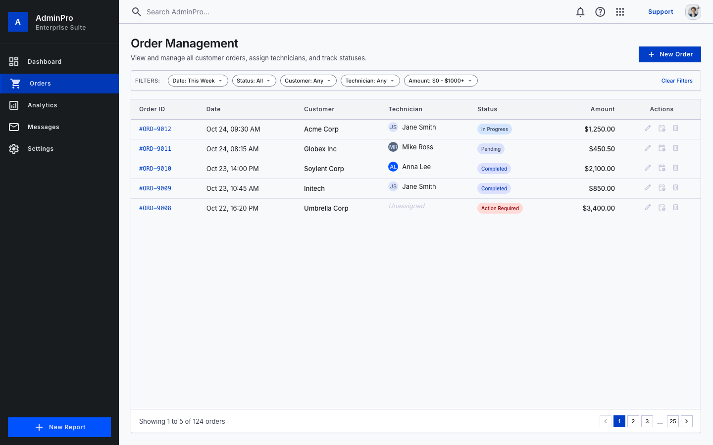
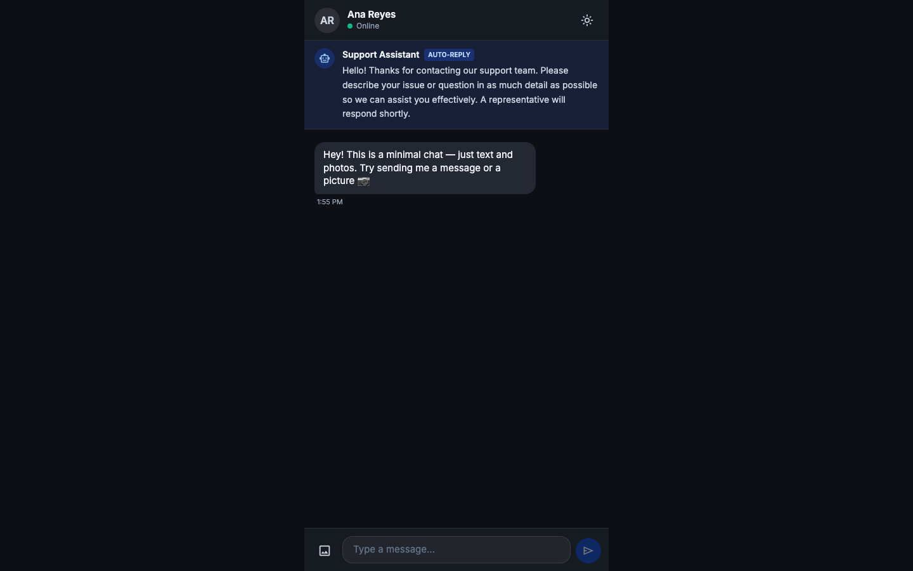
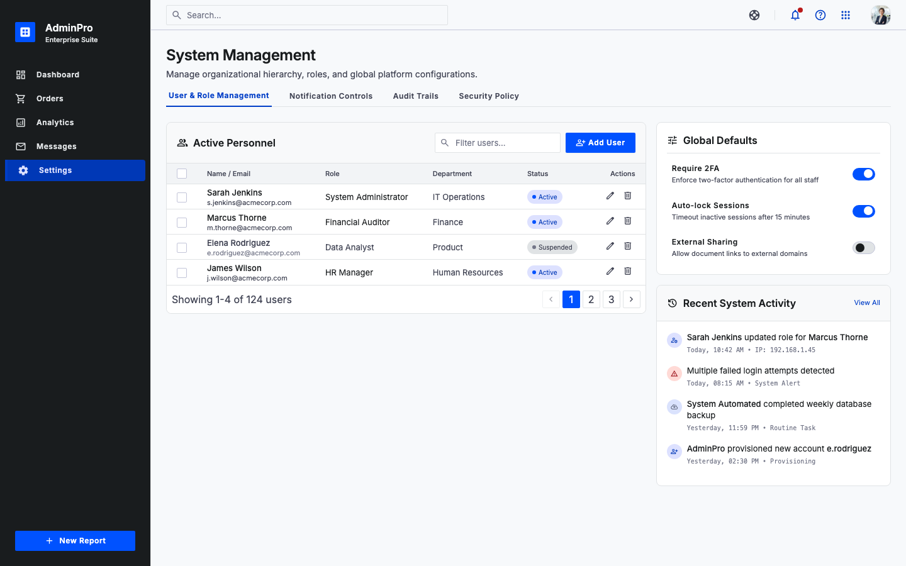
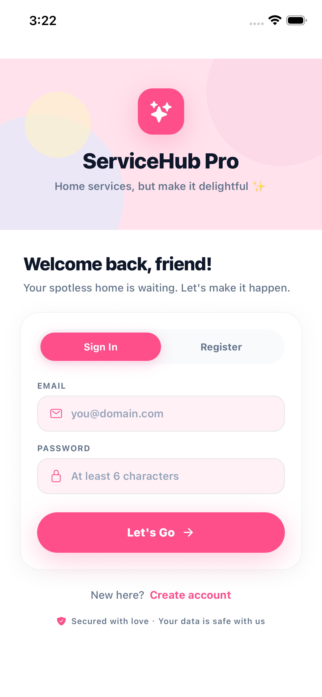
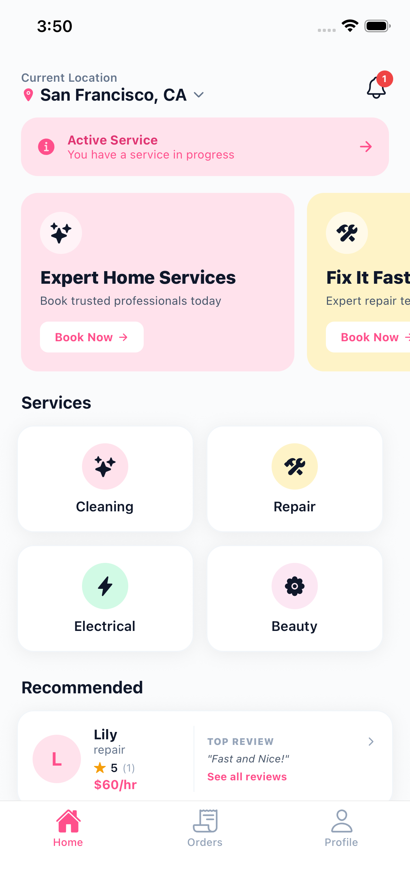
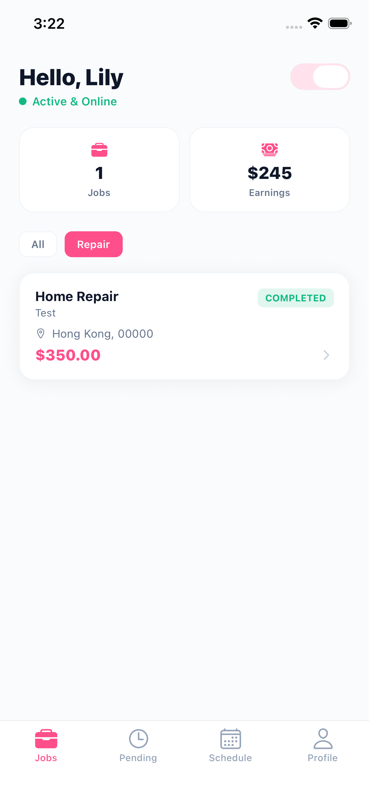

# ServiceHub-App

> **ServiceHub Pro** — a cross-platform home-services marketplace (mobile) connecting customers with technicians for cleaning, repair, electrical, and beauty services.

This repository is a portfolio piece demonstrating production-grade full-stack engineering: a React Native / Expo client backed by a Supabase (PostgreSQL) data layer, with a security-hardened schema, offline-first sync, and tokenized payments.

---

## 🛠 Skills & Technologies

**Mobile & Frontend**
- React Native 0.86 · Expo 57 · TypeScript
- NativeWind (Tailwind for RN) · React Navigation 7
- Advanced CSS · glass-morphism · responsive typography · micro-interactions
- Laravel · Livewire · FluxUI · Alpine.js (web stack)
- Three.js / WebGL (immersive, performance-tuned experiences)

**Backend & Data**
- Supabase: Auth · Realtime · Storage · Row-Level Security (RLS)
- PostgreSQL: versioned SQL migrations, triggers, functions
- REST API design & full-stack integration

**Engineering Quality**
- Offline-first architecture: layered caching (memory → AsyncStorage → Supabase), incremental sync, conflict resolution (last-write-wins)
- Security hygiene: no plaintext secrets in client, tokenized payments (no PAN/CVV stored), RLS-enforced isolation
- Testing: Vitest unit suites · `tsc --noEmit` type safety
- Performance: 60fps targets, lazy loading, optimized asset delivery

---

## 🚀 Notable Work

**ServiceHub Pro — Marketplace Platform** *(this repository)*
Led architecture and implementation of a complete home-services marketplace:
- Rebuilt auth on Supabase Auth with `profiles` table and full RLS row isolation (replacing an insecure custom-users approach).
- Designed a three-tier offline cache with incremental pull and an offline mutation queue (exponential backoff, LRU eviction).
- Implemented tokenized payment methods (brand/last4/exp only — no full card data) with Luhn + validity pre-validation.
- Built a reviews/ratings system with a DB trigger maintaining technician averages.
- Enforced role & category rules (technicians accept only matching categories; earnings visible only on completed jobs).

**Premium Web Experiences — Laravel / Livewire / FluxUI**
Marketing and SaaS front-ends with glass-morphism surfaces, magnetic interactions, and light/dark/system theming — balancing craft with sub-1.5s loads.

**Immersive 3D Showcases — Three.js**
WebGL hero sections and interactive product viewers (particle systems, parallax) tuned to 60fps on mid-range hardware.

---

## 🌐 How to Open — Website (Admin Dashboard)


### Option A — Open it online (shareable link, no setup)

| Link | Status | Notes |
|---|---|---|
| **https://369d7f5a05464fb58f912abf8a0176ca.app.codebuddy.work** | ✅ live now | CloudStudio sandbox preview — share today |
| **https://cocokona.github.io/ServiceHub-App-clean/** | ⏳ enable once | Permanent GitHub Pages address (see below) |


### Option B — Run it locally
```bash
cd admin-dashboard
cp .env.example .env          # then fill in your Supabase values (see below)
npm install
npm run dev                   # opens at http://localhost:5173
```
Build a production bundle: `npm run build` (outputs to `admin-dashboard/dist/`).

---

## 📱 How to Open — Mobile App (ServiceHub Pro)

The mobile app is a React Native + Expo project at the repo root. The easiest way to try it is with **Expo Go** (no app-store install needed).

### Prerequisites
1. Install [Node.js](https://nodejs.org) (LTS).
2. Install the **Expo Go** app on your phone:
   - iOS: App Store → "Expo Go"
   - Android: Play Store → "Expo Go"
3. *(optional, for sharing a try-link)* install EAS CLI: `npm install -g eas-cli`

### Run locally and scan the QR code
```bash
cp .env.example .env          # fill in your Supabase values (see below)
npm install
npm start                     # runs `expo start`
```
A QR code appears in the terminal — **scan it with the Expo Go app** on your phone and the app opens instantly.

Other useful commands:
```bash
npm run web                   # run the app in your browser (Expo for Web)
npm run android               # build/run on a connected Android device or emulator
npm run ios                   # build/run on iOS simulator (macOS only)
```

### Share a try-link without building (Expo publish)
Want others to try the app from a link/QR without cloning the repo? Publish it to Expo's cloud:
```bash
eas update --branch preview   # or: npx expo publish
```
Expo returns a shareable link + QR that anyone with Expo Go can open.

---

## 🔑 Environment Variables (both frontends)

Both the website and the mobile app talk to the same Supabase project, so each needs a `.env` with two public, read-only values (the **anon** key is safe to ship to clients — it's protected by Row-Level Security; **never** put a `service_role` key in client env):

| File | Variables |
|---|---|
| `.env` (repo root, mobile app) | `EXPO_PUBLIC_SUPABASE_URL`, `EXPO_PUBLIC_SUPABASE_ANON_KEY` |
| `admin-dashboard/.env` (website) | `VITE_SUPABASE_URL`, `VITE_SUPABASE_ANON_KEY` |

Copy the matching `.env.example` to `.env` and paste your project URL + anon key (from **Supabase → Project Settings → API**).

---

## 📸 Preview

### Live website — Admin sign-in



The deployed admin dashboard is restricted to company administrators, so the public-facing view is the sign-in screen above. Once authenticated, admins see the dashboard with orders, analytics, messages, and settings.

### Admin dashboard UI mockups (included static template)

The repository also includes a polished static admin dashboard template in `website/stitch_omniadmin_management_dashboard/` that demonstrates the intended visual language:

<p align="center">
  
  
</p>

<p align="center">
  
  
</p>

> These four shots are from the included static template, not the live React admin dashboard. They are included to show the dashboard UI direction; the actual production admin console requires admin authentication.

### Mobile app — iOS

The React Native app opens on the **Sign In** screen. New users can switch to **Register** to create a customer or technician account. After signing in, customers land on the home tab and technicians land on their jobs dashboard.

<p align="center">
  
  
  
</p>

<p align="center">
  <sub><b>Sign in</b> &nbsp;·&nbsp; <b>Customer Home</b> &nbsp;·&nbsp; <b>Technician Dashboard</b></sub>
</p>

Run it locally with:

```bash
npm install
npm run ios   # or npm run android / npm start for Expo Go
```

> Shots captured from the iOS Simulator running a release build of the app.

---

## 📫 Contact

- ✉️ Email: *coco135d@gmail.com*

---

## ©️ Usage Notice

This README and the contents of this repository (code, documentation, and assets) are provided for **personal, professional demonstration only**.

**Any business use, reproduction, redistribution, or sharing — in whole or in part — requires prior written permission.** Please contact me via one of the links above before using or sharing this content in any commercial or public context.

---

<sub>Last updated: 2026-07-16</sub>
